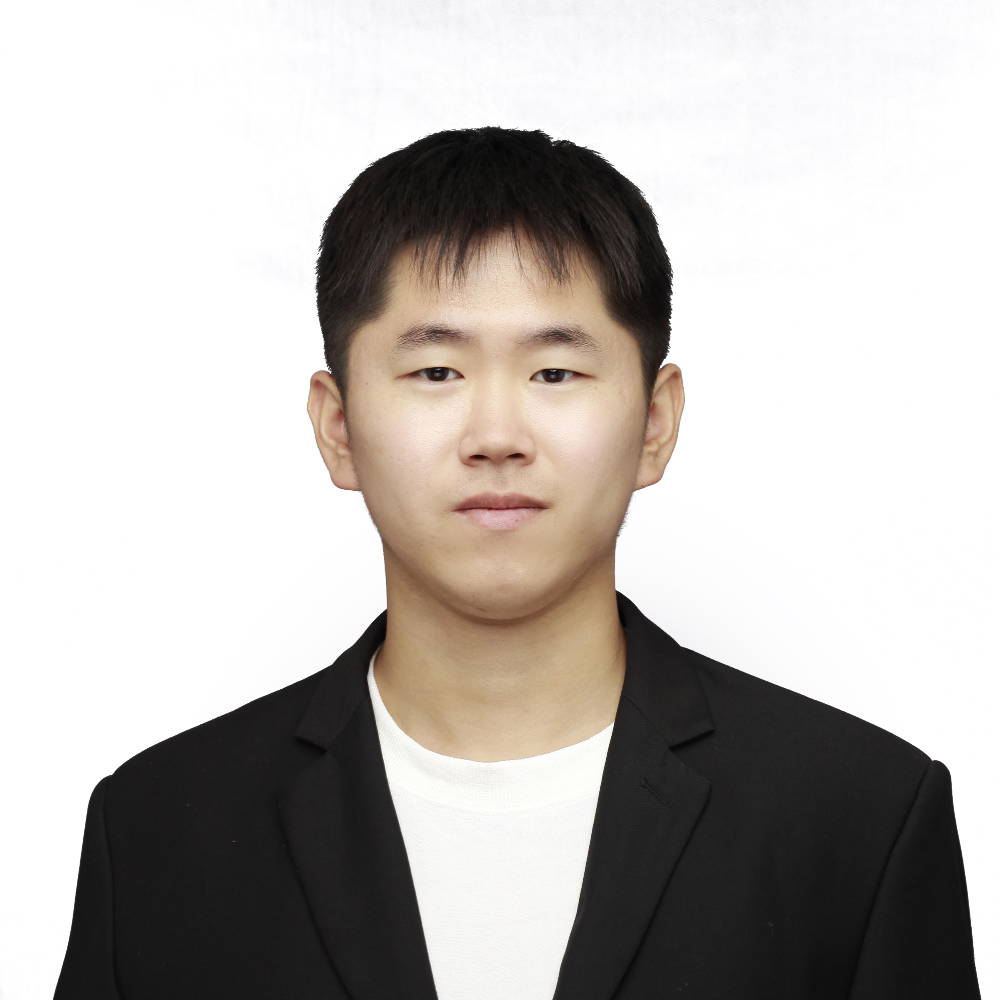
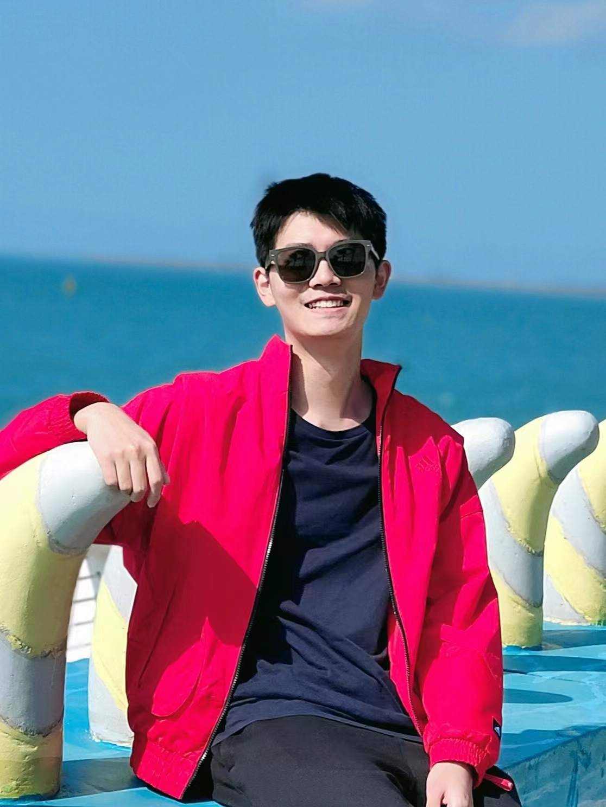
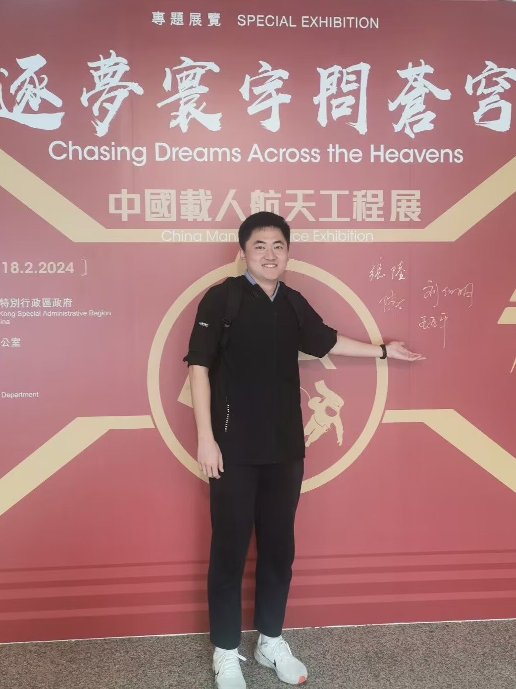
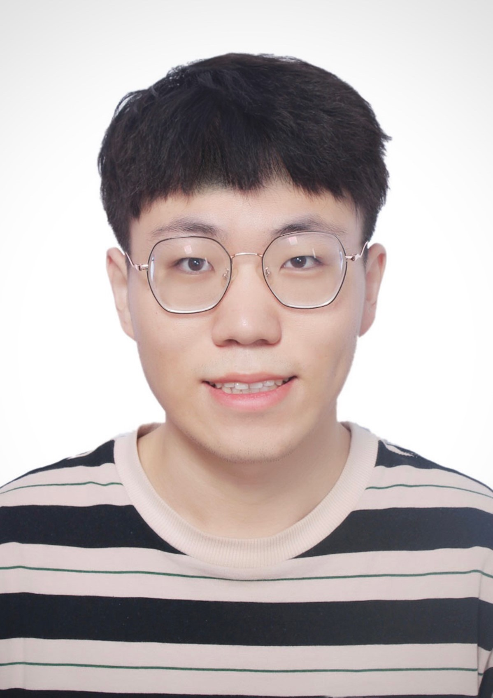

I'm lucky enough to work with a range of fantastic people in different research domains:

Mingcheng Wang (PhD Student)

Mingcheng Wang has been deeply involved in the field of precision measurement in electromagnetics. Over the years, he has accumulated extensive research and practical experience in measurement instruments, analog circuit design, hardware design, and embedded development. He is proficient in using simulation software within his field. Looking ahead, Mingcheng plans to embark on research related to the digital twin framework and verification platform for measurement instruments.

Haochi Wang (MSc Student)

Haochi Wang is currently researching the application of MBSE (Model-Based Systems Engineering) and large language models in downstream tasks. His recent work includes research on model-based safety-critical systems trustworthiness assurance methods and LLMs4SE (Large Language Models for Software Engineering), encompassing prompt engineering and Retrieval-Augmented Generation (RAG).

<a href="https://ruizhe-yang.github.io/">Ruizhe Yang (MSc Student)</a>

Ruizhe Yang is interested in MBSE domain modelling languages and engineering applications. His current research involves analysing and dealing with the management of heterogeneous system models in safety-critical systems. He endeavours to facilitate the interconnection and automated validation of different MBSE files or models by developing novel software tools.

Jiapeng Guan (MSc Student)

Jiapeng Guan is currently focused on the field of hardware-software co-design. His recent work primarily revolves around the temporal aspects of embedded GPUs and various accelerators, including design quantification and reliability. In the past, he has also worked on real-time analysis and fine-grained context switching for GPUs. His research aims to enhance the efficiency and dependability of embedded systems through innovative design and analysis techniques.

