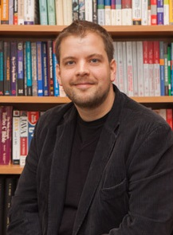
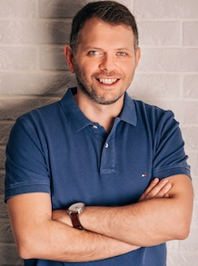
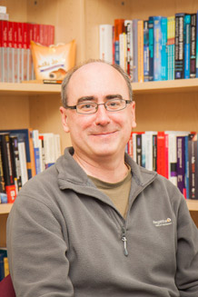

I am blessed to be supervised by kind and experienced mentors during my career, who showed me the path of light not only in academia, but also in life. I only hope to do the same for my students.

  
  

    
<a href="https://scholar.google.com/citations?user=cNeDb_8AAAAJ&hl=en">Prof Rev Tim Kelly</a>

    
Prof Rev Tim Kelly was a professor of Safety Critical Systems Engineering of the High Integrity Systems Engineering (HISE) research group of the Department of Computer Science, University of York. He is an expert in Safety Critical Systems Engineering, and is most known for his work on the Goal Structuring Notation (GSN), a widely used standard for developing safety cases. In 2019, Tim left the University of York to take up a position in the Church of England, he is now the priest in charge of <a href="https://thefourtowers.co.uk/author/rev_tim/">The Four Towers Benefice</a>. Despite his career change, he is still actively engaged with academia, exploring new ideas in the assurance of increasingly intelligent systems.

    
Tim was my line manager (2017–2019) when I worked as a Research Fellow on the DEIS (Dependability Engineering Innovations for Cyber Physical Systems) project, in which he led the development of the concept of Digital Dependability Identity for CPSs.

  

  
  

    
<a href="https://www-users.york.ac.uk/dimitris.kolovos/">Prof Dimitris Kolovos</a>

    
Prof Dimitris Kolovos is a Professor of Software Engineering in the Automated Software Engineering Group of the Department of Computer Science at the University of York, where he researches and teaches model-driven software engineering. He is also an Adjunct Professor at McMaster University (Canada).

    
His main area of research interest is model-driven software engineering. He has co-authored many peer-reviewed papers in the field, sits on the program committees of leading international ACM/IEEE conferences (ACM/IEEE MODELS and ACM SIGPLAN SLE), and is an editor of Springer's Software and Systems Modeling (SoSyM) journal. He is also an Eclipse Foundation committer, leading the development of the open-source Epsilon platform, used in companies such as Rolls-Royce, Bosch and IBM.

    
Dimitris was my PhD supervisor (2012–2016), during which he provided his unreserved support both for my studies and my personal life. From 2013, I was lucky enough to be part of Dimitris' MONDO project, where we researched technologies related to scalable modelling. I worked briefly on Dimitris' SECT-AIR project at the beginning of 2020, right before I went to China to take up my associate professorship; I developed the proof-of-concept prototype for what is now <a href="https://eclipse.dev/epsilon/doc/picto/">Picto</a>.

  

  
  

    
<a href="https://www.eng.mcmaster.ca/cas/faculty/dr-richard-paige/">Prof Richard Paige</a>

    
Prof Richard Paige is the chair in Software Engineering of the Department of Computing and Software, McMaster University. He is interested in software engineering, with a particular focus on Model-Driven Engineering and low-code approaches to software development. Richard is also the director of the Centre for Software Certification at McMaster.

    
Richard was my line manager (2013–2016) when I worked as a Research Associate on the MONDO project, at the time he was also the head of the Enterprise Systems research group, which is now ASE (led by Dimitris). Richard had been very supportive for my job and my PhD studies. I would always remember the times for the Nerf gun fights inside the office in Ron Cooke Hub and the collective endeavours to meet deadlines for mostly the MoDELS conferences.

  

